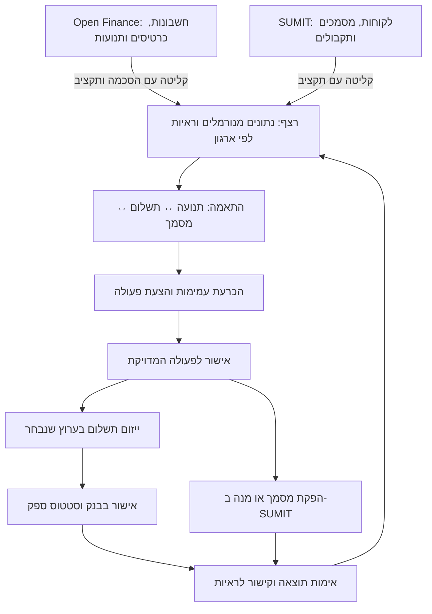

# סוכני AI ובנקאות פתוחה — לימוד ויישום ברצף

תאריך בדיקה: 2026-09-06. מקור: [AI פשוט, פרק 183 עם אלירון ג׳יני](https://www.youtube.com/watch?v=4fdh-8ce_ao), באורך 32:35. התמלול האוטומטי בעברית נקרא במלואו לצורך הניתוח; הוא כולל שגיאות זיהוי, ולכן המסקנות מנוסחות מחדש ומלוות במיקומים בפרק.

זהו מסמך לימוד והמלצות, לא חוזה ספק ולא הוכחת מוכנות לפרוד. סטטוס היכולות נשאר ב־[מניפסט](rezef_capabilities.json), סדר העבודה ב־[חוזה המערכת](REZEF_OPERATING_SYSTEM.md), וסדר הביצוע ב־[תוכנית הראשית](MASTER_EXECUTION_PLAN.md). בדיקת הקוד מתייחסת לעותק העבודה המקומי, הכולל גם שינויים שטרם נשמרו ב־commit.

## המנגנון המרכזי: בנק ↔ רצף ↔ SUMIT

החלק ב־[20:10–22:55](https://www.youtube.com/watch?v=4fdh-8ce_ao&t=1210s) רלוונטי ישירות לליבת המוצר: תקבול בבנק מתחבר למסמך, חוב פתוח מפעיל מעקב גבייה, וקישור תשלום מחבר את הלקוח לביצוע. להלן תרגום הנדסי לרצף על בסיס הקוד וחוזי הפרויקט; אין בפרק מפרט מלא של המימוש הזה.

**רצף מנהלת את הקשר בין האירועים והמסמכים.** Open Finance מספקת תצפיות בנק ואשראי וערוץ לייזום תשלום; SUMIT מספקת מסמכים, לקוחות, תקבולים רשומים וספרים רשמיים. שני מחברים פעילים הם תנאי כניסה. ההשלמה העסקית דורשת שרשרת ראיות שמקשרת ביניהם.

זהו תרשים יעד המפריד קליטה, הכרעה וביצוע. החצים לכתיבה רשמית כפופים לפערים המפורטים בהמשך; התרשים אינו טענה שכל המעברים מחוברים היום.

## אילו תהליכים אפשר לחבר

| אירוע עסקי | נתוני המקור | העבודה של רצף | תוצאה נדרשת וגבול |
| --- | --- | --- | --- |
| לקוח העביר כסף | תנועת זכות מהבנק; לקוח, חשבוניות ותקבולים מ־SUMIT | לזהות למי ולמה שייך התקבול, לבדוק אם כבר נרשם, ולהקצות למסמך אחד או יותר | רישום התקבול והמסמך המתאים במסלול המאושר, עם מזהי המקור ועדכון יתרה; סכום ושם אינם זיהוי ודאי |
| חשבונית נותרה פתוחה | יתרת חשבונית ותנאי תשלום; תמונת בנק טרייה | לבדוק אם שולם אך טרם הותאם, לזהות חוב אמיתי ולהכין פעולת גבייה | קישור בגובה החוב המאומת בערוץ אחד; שליחת הודעה כפופה למדיניות התקשורת ולהרשאה |
| ספק הגיע למועד תשלום | חשבונית ספק/הוצאה, יתרת חוב ופרטי מוטב מאומתים | להכין הצעת תשלום עם ראיות וסכום מדויק | אישור → בקשת תשלום → אישור המשלם בבנק → אימות תוצאה → התאמה; אין לסגור חוב בעת יצירת הקישור |
| ירד חיוב ללא אסמכתא מקושרת | תנועת חובה בבנק/כרטיס; מסמכי הוצאות | לבדוק העברה פנימית, עמלות, החזר או חיוב שכבר מכוסה, ולפתוח בירור מתאים | תור מסמך חסר רק כשהסיווג מצדיק זאת; תנועת בנק לבדה אינה בוחרת כלל מס או סוג מסמך |
| הלקוח שילם חלקית או שילם כמה חשבוניות יחד | תשלום וחשבוניות פתוחות | להקצות סכומים, להשאיר יתרה ולהציג מחלוקת | נדרש קשר הקצאה עם סכום; התאמה של מסמך יחיד לתנועה יחידה אינה מספיקה |
| זיכוי או החזר | מסמך נגדי/תקבול נגדי ונתוני הספק והבנק | לקשר לפעולה המקורית ולעדכן את שרשרת הראיות | מסמך זיכוי והחזר כספי הם אירועים נפרדים; אין לבצע החזר נוסף מפני שכבר קיים זיכוי |
| סליקת כרטיסים או העברה בין חשבונות העסק | עסקאות, סיכום סליקה ותנועות בנק | לזהות כמה רשומות המתארות אותו מעבר כסף ולהסביר עמלות/הפרשי מועד | למנוע ספירה כפולה של הכנסה או הוצאה; סכום נטו בבנק אינו חייב להשתוות לעסקה בודדת |
| תמונת תזרים וגבייה | יתרות בנק, חובות לקוחות, חובות ספקים ופעולות ממתינות | להפיק תזרים, חסרים והחלטות מתוך העותק המקומי | להפריד בפלט עובדות, צפי ובקשות שטרם הושלמו, עם תאריך וראיות |

אלו תהליכי יעד וקריטריונים לבדיקה. סטטוס הקליטה הוא `gated`, ההתאמות והגבייה `partial`, והספרים הכפולים `blocked` לפי המניפסט שנקרא; הטבלה אינה מרחיבה את גבולותיהם.

## שני מסלולי קישור תשלום, ופרוטוקול נפרד

| רכיב | תפקיד | מה נמצא ומה נדרש |
| --- | --- | --- |
| קישור תשלום של SUMIT | גביית יתרת חשבונית דרך עמוד תשלום מתארח | `DocumentIssuanceService.create_payment_link(invoice_id)` קורא את היתרה ומפעיל `SumitIntegration.create_payment_link`, המשתמש ב־`/billing/payments/beginredirect/`. הפונקציה מחזירה URL ומזהה חשבונית; נדרש מעקב אחר התשלום שנוצר והמסמכים שנוצרו אצל הספק |
| בקשת העברה של Open Finance | תשלום בנקאי למוטב דרך מסע תשלום | כלי מושקו `_create_bank_payment_request` יוצר `paymentInformation` ומחזיר מזהה ו־`payUrl`. בחתימתו אין `invoice_id`, ובגוף הפונקציה אין שמירת קשר לחשבונית; יש לבדוק ולהשלים את הקישור העמיד ואת האימות לאורך המסלול |
| MPP — Machine Payments Protocol | תיאום תשלום בין סוכן לשירות תומך | Stripe מתארת בקשת משאב → דרישת תשלום → אישור → אספקת המשאב. אין בראיות שנבדקו כאן הוכחה ש־SUMIT או מחבר Open Finance שלנו תומכים ב־MPP |
| ממשק כלים / MCP | הדרך שבה הסוכן מפעיל יכולות של רצף | הוא אינו הוכחת תשלום או רישום חשבונאי. לפי `REZEF_CLI_ROADMAP.md`, MCP עתידי של רצף יעטוף את ה־API עם בידוד ומדיניות; חיבור Financy MCP ישיר ל־runtime אינו המסלול המתוכנן |

מקורות המימוש: [document_issuance_service.py](../src/cfo/services/document_issuance_service.py), [sumit_integration.py](../src/cfo/integrations/sumit_integration.py), [ai_chat_tools.py](../src/cfo/services/ai_chat_tools.py), [תוכנית CLI/MCP](REZEF_CLI_ROADMAP.md). מקור הפרוטוקול: [Stripe — MPP](https://stripe.com/blog/machine-payments-protocol).

**משמעות מוצרית:** פעולה אחת צריכה לבחור ערוץ גבייה ולהחזיק מזהה מתאם יציב. אפשר להציע תשלום SUMIT או תשלום בנקאי, אך רישום התוצאה חייב לחזור לאותה יתרת חוב. אם הספק כבר הפיק מסמך במסגרת הגבייה, רצף צריכה לזהותו לפני הפקה נוספת. פרוטוקול תשלום אינו מבצע את ההתאמה הזאת בשבילנו.

תיעוד Financy מציג `externalId` כמזהה חיצוני שמוחזר עם התשלום, וכן `callbackInformation` לאירועי תשלום. אלו מועמדים לקישור ולעדכון, בכפוף לאימות חוזה המוצר וההרשאות שבהם רצף משתמשת. תיעוד Financy גם מגביל תשלום למעורבות חשבון מחובר ומפנה ליצירת חיבורים בממשק שלו; אין להחיל זאת אוטומטית על מסלול ה־API הארגוני של Open Finance. [Create a Payment](https://docs-financy.open-finance.ai/docs/create-a-payment).

## ארבעה פערים שנמצאו בשרשרת הקיימת

### א. המנוע הנוכחי אינו התאמה משולשת מלאה

[bank_reconciliation.py](../src/cfo/services/bank_reconciliation.py) טוען `BankTransaction` מול `Invoice`, `Bill` ו־`Expense`; `reconcile_organization` אינו טוען `Payment`. המנוע מבצע התאמה לפי סכום, תאריך ושם ומאפשר שימוש אחד במסמך בכל ריצה. הוא אינו מממש לבדו הקצאת תשלום חלקי או תשלום אחד לכמה חשבוניות.

בניסוי מקומי נקודתי הופעלה רק הפונקציה הטהורה `reconcile`, ללא DB או רשת: תנועה סינתטית בסכום 1,000, מסמך באותו סכום ובאותו יום, ללא שם/תיאור מזהה, עם `is_provisional=True`. התוצאה הייתה התאמה אחת בציון `1.0`. כאשר `persist=True`, עטיפת ה־DB מסמנת את ההתאמות כ־`is_reconciled=True`.

זהו פער מול [נוהל ההתאמות](bookkeeper_kb/13-workflow-bank-reconciliation.md), הדורש להשאיר התאמה חלשה כהצעה. הציון הוא תוצאת נוסחה ולא הסתברות מאומתת. לפני הרחבת אוטומציית מסמכים, צריך להפריד הצעה מהכרעה ולהוסיף את ראיית התשלום ואת ההקצאה.

### ב. ״הותאם ברצף״ עדיין אינו ״נרשם ב־SUMIT״

[reconciliation_dispatch.py](../src/cfo/services/reconciliation_dispatch.py) מחפש `post_bank_reconciliation` במחבר, ומחזיר `unsupported` אם הפעולה אינה קיימת. [הטסט הקיים](../tests/test_reconciliation_dispatch.py) מצפה במפורש ל־`is_reconciled=True` מקומי לצד `reconciliation_dispatch_status=unsupported`.

נוהל ההתאמות מתאר כתיבה דרך `createbatch`, אבל שירות ה־dispatch שנבדק אינו מחבר אליה את התוצאות. קיים [adapter נפרד למנה](../src/cfo/api/routes/accounting.py) הכפוף לאישור ומחזיר `executed_unverified`. לפי החוזה והמניפסט, יצירת מנה פתוחה אינה הוכחה לקליטה בספרים סגורים; readback וסגירה בפורטל נשארים גבול נפרד. אין להציג את ניסוח היעד בנוהל כראיית מימוש של הגשר הזה.

### ג. קליטת תשלומים אינה מוכיחה שהקשר לחשבונית נשמר

[SumitConnector.fetch_payments](../src/cfo/services/sumit_connector.py) מאחד תשלומי סליקה וקבלות למבנה `NormalizedPayment`. במסלול שנבדק לא ממולא `invoice_external_id`. [SyncEngine._upsert_payment](../src/cfo/services/sync_engine.py) יודע לקשר חשבונית כשמזהה זה מגיע. נדרש לאמת אילו קשרי מקור זמינים לכל סוג מסמך ולהעבירם, או להשאיר התאמה ממתינה. אין לנחש את הקשר מתוך סכום.

אותו תקבול עלול להופיע בכמה מערכות ובכמה סוגי רשומה. יש לשמור גם מרחב מזהים לפי מקור וסוג ישות וגם קשר עסקי ביניהם, כדי שחשבונית, קבלה, תשלום סליקה ותנועת בנק לא ייספרו כארבע הכנסות.

### ד. אימות בקשת תשלום והשלמת תשלום דורשים משמעות נפרדת

הממצא של `verified` לצד `PENDING`, המפורט בהמשך, חיוני לסגירת השרשרת: יצירת בקשה, הרשאת המשלם, סטטוס סליקה, תנועת בנק ורישום מסמך הם ראיות לשלבים שונים. כל מעבר צריך לציין מה אומת ולאיזו ראיה הוא קשור.

## תרחיש קבלה מוצע: לקוח, חשבונית ותשלום אחד

זהו סדר תלות מומלץ למימוש תחת השערים הקיימים בתוכנית הראשית, לא לוח סטטוס חדש.

1. בארגון פיילוט אחד, לטעון חשבונית עם יתרה ולקוח מזוהה יחד עם נתוני בנק; להראות כיסוי וטריות לכל מקור. תחילה נתונים סינתטיים בלבד.
2. ליצור הצעת גבייה שמקושרת לחשבונית וליתרה המאומתת, לבחור ערוץ אחד, ולשמור את פרטי הבקשה המאושרים ואת מזהה הספק. ההצעה אינה נשלחת ללקוח בשלב הבדיקה.
3. לדמות תגובות `PENDING`, כשל והשלמה. בקשה ממתינה אינה מסיימת את החוב. webhook משוכפל אינו יוצר תשלום או מסמך נוספים; אימות ספק אינו עוקף מכסות.
4. לקשר את התקבול לחשבונית, לקבלה קיימת או להצעת המסמך הנדרש ולתנועת הבנק. לבדוק גם תשלום חלקי ותקבול שכבר נרשם ב־SUMIT.
5. ליצור הצעת כתיבה רשמית רק לאחר שהקשרים הוכרעו; להשתמש במנגנון האישור הקיים ולשמור את תוצאת הספק. מסלול שאינו נתמך נשאר גלוי.
6. להריץ שוב את אותם אירועים ואת אותו סנכרון: אין כפילות במסמכים, בהכנסה, בהתאמות או בתשלומים; אין גישה לארגון אחר.
7. פלט המשתמש מציג מה קרה: מה שולם, מה עדיין ממתין, מה נרשם ב־SUMIT ואיזה אימות חסר. המעבר לפיילוט חי נפרד מבדיקת הקוד וכפוף לשערי הפרויקט.

**העדיפות המוצעת:** להשלים את הקשרים, ההקצאות והראיות בין הרכיבים שכבר קיימים. כך ניתן להוכיח את התהליך שהפרק מתאר; שילוב פרוטוקול תשלום נוסף ייבחן רק מול צורך ותמיכה מאומתים.

## מה לקחת מהפרק

| מיקום | תמצית הרעיון |
| --- | --- |
| [07:20–10:50](https://www.youtube.com/watch?v=4fdh-8ce_ao&t=440s) | תוכן חיצוני עלול להסיט סוכן. הגבלות על כלים צריכות להיאכף בקוד, כולל אישור מפורש לפני העברת כסף. |
| [11:27–13:15](https://www.youtube.com/watch?v=4fdh-8ce_ao&t=687s) | תשלום דרך תשתית ייעודית יכול לצמצם חשיפה של פרטי כרטיס לסוכן. נדרשת תמיכה ממשית בתשתית. |
| [17:06–20:06](https://www.youtube.com/watch?v=4fdh-8ce_ao&t=1026s) | גישה למידע מאפשרת מעקב הכנסות, הוצאות ומנויים. הרשאת קריאה ויכולת תשלום הן יכולות שונות; גם קריאה מחייבת בחינה של יעד המידע ושמירתו. |
| [20:10–22:55](https://www.youtube.com/watch?v=4fdh-8ce_ao&t=1210s) | שילוב נתוני בנק עם SUMIT מאפשר התאמות ומעקב גבייה. נידונים גם קישורי תשלום, הוראות קבע ותשלומים מרובים. |
| [24:47–25:21](https://www.youtube.com/watch?v=4fdh-8ce_ao&t=1487s) | דליפת מידע פיננסי היא סיכון גם כשאין אפשרות להעביר כסף. |
| [26:57–27:28](https://www.youtube.com/watch?v=4fdh-8ce_ao&t=1617s) | מפתחות API צריכים להישאר מחוץ לתוכן השיחה. |
| [29:42–30:16](https://www.youtube.com/watch?v=4fdh-8ce_ao&t=1782s) | המשתמש צריך להבין את הפעולה ואת הסיכון לפני אישור. |

## התאמה למערכת הקיימת

| תחום | מה נמצא ברצף | המשמעות להמשך |
| --- | --- | --- |
| קליטת בנק | `open-finance-ingestion` מסומן `gated`. קיימים מסע הסכמה, בידוד ארגוני, נרמול וקריאה מה־DB. השערים: `organization_scope`, `daily_sync_budget`, `idempotency`, `customer_consent`, `environment_configuration`. | אין להסיק שיש תמונת בנק לחברה בלי הסכמת בעלים שהושלמה, scopes תקינים וסנכרון חי מוצלח. הפרק אינו ראיה שהשערים נפתחו. |
| התאמות וגבייה | `bank-reconciliation` ו־`ap-ar-collections` מסומנים `partial`; שלמות תלויה בטריות ובנתוני המקור. | להשלים ראיות והתאמות דרך המנועים הקיימים. התאמה חלשה נשארת בתור הכרעה; תקבול אינו הוראה אוטומטית להפיק סוג מסמך מסוים. |
| אישור תשלום | [נתיב התשלום](../src/cfo/api/routes/open_finance.py) צורך `X-Rezef-Approval-Id`, משתמש ב־payload שמור, תובע ביצוע יחיד ושומר readback. [הטסטים](../tests/test_approved_open_finance_payment.py) מכסים היעדר אישור, שינוי payload ו־replay. | יש בסיס לאכיפה מחוץ למודל. ראיית קוד וטסט אינה אישור להפעיל תשלומים חיים. |
| מנויים וחריגות | [bank_insights.py](../src/cfo/services/bank_insights.py) כולל `detect_subscriptions`, כפילויות, עמלות, חריגות ועוד; קיימים [טסטים ממוקדים](../tests/test_bank_insights.py). | להרחיב את המנוע הקיים לפי צורך מוכח, ולשמור מזהי תנועות כראיות. |
| זהות וסודות | [open_finance_onboarding.py](../src/cfo/services/open_finance_onboarding.py) מפריד זהות לפי ארגון; [credentials_vault.py](../src/cfo/services/credentials_vault.py) מצפין אישורי גישה ב־DB. | סודות נצרכים בצד השרת. קובץ סודות שהסוכן יכול לקרוא עדיין דורש בקרת גישה; עצם ההעברה מהצ׳אט לקובץ אינה הוכחת הגנה. |

הראיות בתחום ההסכמה כוללות גם [test_open_finance_onboarding.py](../tests/test_open_finance_onboarding.py): תגובות ספק חלקיות, חשבון משותף, חסימת מזהה מארגון אחר ודרישת admin לפני גישת ספק. זו סקירת קוד וטסטים קיימים; לא הורצו בדיקות ביצוע במסגרת הלימוד.

## המלצות קונקרטיות על בסיס בדיקת הפרויקט

אלו מסקנות הנדסיות מהקוד ומהחוזים של רצף. הן אינן ציטוט או טענה שהדובר בדק את המערכת שלנו. לפני מימוש יש לשייך את העבודה לשער המתאים בתוכנית הראשית, לכתוב טסט אדום ולפעול ללא קריאות ספק חיות.

### 1. להבחין בין אימות יצירת בקשת תשלום לבין השלמת התשלום

ב־`create_payment` קבלת readback שאינו ריק ובדיקת התאמת מזהה מובילות ל־`mark_verified`. הטסט `test_approved_payment_uses_persisted_payload_and_verifies_readback` מצפה ל־`verified` גם כאשר `paymentStatus` הוא `PENDING`. כלומר, הראיה המקומית מוכיחה יצירת בקשה אצל הספק; היא אינה מוכיחה שהכסף עבר.

המלצה: להציג בנפרד את אימות בקשת הפעולה ואת סטטוס התשלום אצל הספק. לפני שינוי מודל המצבים, לבדוק מי צורך את `verified` ומה הוא מבטיח למשתמש. אין לסגור יתרת ספק או להציג ״שולם״ על סמך `PENDING`.

תנאי קבלה מוצע: readback עם `PENDING` מוצג כבקשה שממתינה להשלמה; כשל, ביטול או מזהה שונה אינם השלמה; סגירת החוב דורשת ראיית התשלום המתאימה. למונחי הספק יש להיצמד ל־[מרכז הידע](OPEN_FINANCE_KNOWLEDGE_BASE.md), סעיף 4.3, ולא להניח שכל סטטוס קבלה הוא סליקה.

### 2. למפות בדיוק איזה מידע מגיע למודל

ב־[ai_chat_service.py](../src/cfo/services/ai_chat_service.py), `send_message` שומר את טקסט המשתמש ומצרף אותו ואת ההיסטוריה לבקשת המודל; `_make_client` יוצר לקוח Anthropic ישיר. נמצא גם כלי משרד בעל פרמטר `api_key` ב־[ai_chat_tools.py](../src/cfo/services/ai_chat_tools.py). הגנת כלי לפי תפקיד אינה לבדה מנגנון להסרת סוד מתוכן שיחה.

המלצה: לסקור קלט משתמש, תוצאות כלים, זיכרון, לוגים ואבחון שגיאות לאורך מסלול המודל; להגדיר לכל שדה אם הוא נחוץ, ממוסך או חסום. קלט סודות צריך לעבור במסך ההגדרות אל הכספת. אין להסיק ממימוש ההצפנה ב־DB שקיים צמצום מידע בכל היציאות.

תנאי קבלה מוצע: סוד סינתטי בקלט אינו מגיע לבקשת המודל או ללוג; סיכום יתרה מקבל רק את השדות הדרושים ולא dump של אישורי הגישה; תוצאות של ארגון אחר חסומות. מדובר בבדיקות עם לקוח מודל מזויף.

### 3. לבחון ניסיונות הסטה דרך נתונים, מעבר למסלול האישור התקין

הבסיס המחייב כבר נמצא ב־[חוזה המערכת](REZEF_OPERATING_SYSTEM.md) וב־[בקרת פעולות בלתי־הפיכות](IRREVERSIBLE_ACTION_CONTROL.md): בדיקת מדיניות בהצעה, באישור ובביצוע, בידוד ארגוני ו־payload שאינו משתנה אחרי אישור.

תנאי קבלה מוצע: תיאור תנועה, שם ספק או תוכן מסמך שמבקשים לשנות מוטב, לחשוף מפתח או לשלוח מידע ליעד חיצוני אינם מקנים הרשאה. לבדוק גם ניסיון קריאת כלי זדוני באמצעות תגובת מודל מדומה, כך שההגנה נבחנת בקוד ואינה תלויה בניסוח הפרומפט. סקירה זו אינה טענה שנבדקו כל מסלולי הכתיבה או שכל ההגנות חסרות.

### 4. להציג למשתמש מצב הסכמה וטריות עם משמעות ברורה

`get_connection_status` כבר מחזיר `status`, `expiry` ו־`last_fetched`, ושומר את תשובת הספק. התשתית מאפשרת לבחון מסך שמבהיר: לאיזה עסק החיבור שייך, אילו חשבונות מכוסים, מה מצב ההסכמה ומתי התקבל המידע האחרון. שדה שאין עבורו ראיה נשאר לא ידוע.

תנאי קבלה מוצע: חיבור שפג או שבוטל אינו מוצג כמידע מעודכן; מידע היסטורי נשמר עם תאריך המקור; פתיחת המסך ושאלה בצ׳אט אינן מפעילות סנכרון. לשמור את שער 20 השעות ואת בידוד החיבורים גם במסלול חידוש ההסכמה.

### 5. להוסיף הבחנה ממוקדת בשינוי מחיר מנוי

`detect_subscriptions` מזהה חיובים חודשיים עקביים לפי חציון וסבילות. בפונקציה שנבדקה אין התראה ייעודית המשווה את החיוב האחרון למחיר ההיסטורי של אותו מנוי. זיהוי חריגה כללי קיים בנפרד ואינו הוכחה לכיסוי מקרה זה.

תנאי קבלה מוצע: סדרה סינתטית של שלושה חודשים בסכום 100 ולאחריהם חיוב 140 לאותו ספק ובאותו מטבע יוצרת הצעת בדיקה עם מזהי המקור. זיכוי, שני חשבונות שונים או תקופה חסרה אינם מוצגים כהתייקרות ודאית. הפקת התובנה קוראת מה־DB, ללא API נוסף. עדיפותה כפופה להשלמת קליטה וטריות בפיילוט.

## דיוקים מול מקורות רשמיים

- **אישור בנק:** התיעוד הרשמי מתאר הזדהות ואישור של הוראת קבע, הכוללת תדירות ומועדים. לכן אין להסיק שהלקוח יאשר מחדש כל חיוב עתידי; צריך לבדוק את סוג ההרשאה ואת גבולותיה. [Open Finance — Periodic Payment Initialization](https://docs.open-finance.ai/docs/periodic-payment-initialization).
- **פרוטוקול תשלום:** השם MPP שנאמר בהסתייגות בפרק אומת: Machine Payments Protocol, פיתוח משותף של Stripe ו־Tempo. קיומו אינו מוכיח תמיכה בספקי התשלום שלנו או צורך לשלבו ברצף. [הכרזת Stripe](https://stripe.com/blog/machine-payments-protocol).
- **אישורי גישה:** תיעוד Open Finance מפריד `userId` לפי משתמש ומזהיר מפני חשיפת `clientSecret`; עצם קיום טוקן אינו הוכחה שיש לו רק הרשאות קריאה. [Access Tokens](https://docs.open-finance.ai/docs/access-tokens).
- **שמירת מידע בענן:** לא אומתה בסקירה זו מדיניות שמירת המידע בחשבונות הספקים של רצף. אין לקדם אמירה כללית על Zero Data Retention להבטחה מוצרית; נדרשת ראיה עבור השירות, החשבון והתצורה שבהם משתמשים בפועל.
- **הפקת מסמכים בעקבות תקבול:** סוג המסמך, היעדר כפילות והראיות הנדרשות נקבעים לפי [מרכז הידע החשבונאי](bookkeeper_kb/README.md) ומסלול העבודה הקיים. הדגמה בפודקאסט אינה כלל חשבונאי.

## מה הוטמע במסגרת הלימוד

נוסף מסמך זה וקישור מאינדקס התיעוד וממרכז הידע של Open Finance. לא שונו סטטוסי יכולות, קוד עסקי או סדרי עדיפות בתוכנית הראשית. המסמך זמין לסוכני פיתוח דרך התיעוד; הוספת קובץ כשלעצמה אינה מוכיחה שאונדקס או נגיש למושקו בזמן ריצה. קידום המלצה לנוהל או להתנהגות מוצר דורש מימוש וראיות מתאימים.
