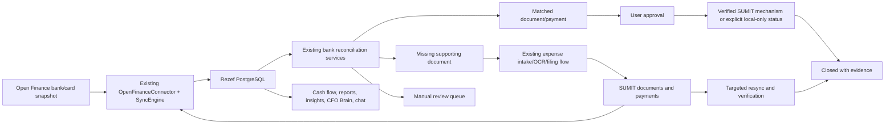

# Rezef ↔ SUMIT ↔ Open Finance — Completion Plan

**Status:** Planning only — no implementation authorized by this document  
**Prepared:** 2026-07-09  
**Primary pilot organization:** Organization 1 — עמית פורת  
**Execution checklist:** [`REZEF_SUMIT_OPEN_FINANCE_TODO.md`](REZEF_SUMIT_OPEN_FINANCE_TODO.md)

## 1. Purpose

Complete and verify the existing Rezef capabilities around SUMIT and Open Finance without inventing a second accounting engine or claiming capabilities that the external APIs do not expose.

The required outcome is an evidence-backed financial loop:

1. Bank and card data is retrieved from Open Finance with controlled API usage.
2. Accounts and transactions are stored idempotently in Rezef and are visible to the user.
3. Rezef matches bank/card movements to SUMIT-backed invoices, bills, expenses and payments.
4. Outgoing business transactions without supporting documents become an actionable missing-document queue.
5. Existing cash-flow, reports, insights, CFO Brain and chat capabilities use the persisted bank snapshot.
6. Approved reconciliation results are represented honestly in Rezef and are transferred to SUMIT only through an officially supported mechanism.
7. Source counts, amounts, freshness and reconciliation coverage prove data completeness.

This plan intentionally prioritizes operating and completing existing capabilities. New product tools and speculative SUMIT adapters are deferred until a separate design decision.

## 2. Current verified state

### 2.1 Rezef production

- Production health endpoint is healthy.
- PostgreSQL is connected and the core schema is present.
- Four organizations exist in production.
- SUMIT is active for organizations 1, 2 and 5; organization 3 is inactive because of invalid credentials.
- Organization 1 is partially blocked by the SUMIT `ActionsBilling obligo` limit.
- No `open_finance` `IntegrationConnection`, `BankConnection` or `BankTransaction` currently exists in Rezef production.
- The active cron runs a full multi-source sync every hour.
- `SyncEngine.run_full_sync()` does not pass an `updated_since` watermark to connector fetches.
- SUMIT therefore re-reads large document windows, while Open Finance would re-read transaction history if enabled through the current cron.
- The current full test suite result is 796 passed, 0 failed.

### 2.2 Financy / Open Finance account observed for the pilot

- A live Bank Hapoalim connection exists.
- The UI shows checking, credit-card, savings and credit-line/account representations.
- The dashboard shows 416 recent transactions over the selected three-month period.
- The active connection was last synchronized 18 hours before the inspection.
- Two older Hapoalim connections are expired and must not be used as active sources.
- The account is on the Financy Free plan.
- The Financy UI explicitly states that API access is locked on that plan and data refresh is limited to once per day.
- Rezef has Open Finance client credentials configured globally, but `OPEN_FINANCE_USER_ID` is missing. The relationship between those developer credentials and the consumer Financy account is not yet proven.

### 2.3 SUMIT boundary

- SUMIT document, customer, debt, payment, expense and filing APIs are implemented in Rezef.
- Local project documentation and connector code do not expose an official SUMIT bank-reconciliation or journal-entry write API.
- The SUMIT UI exposes journal-movement/file-import functionality, but its file contract and confirmation workflow have not yet been verified for this company file.
- A customer remark is an audit annotation, not an accounting bank reconciliation.
- The review-branch implementation called `post_bank_reconciliation()` only creates a customer remark for linked invoice customers and returns `unsupported` for many bill/expense cases. It must not be described as native SUMIT reconciliation.

## 3. Source-of-truth boundaries

| Concern | System of record | Rezef responsibility |
|---|---|---|
| Bank and card movements | Open Finance / connected institution | Persist normalized snapshot plus original evidence |
| Sales and purchase documents | SUMIT | Sync, normalize, cross-check and link |
| Reconciliation decision | Rezef until a supported SUMIT posting is confirmed | Score, suggest, approve, audit and track lifecycle |
| Missing supporting document | Rezef operational queue | Detect, explain, collect and close after document arrival |
| Accounting books in SUMIT | SUMIT | Export/post only through a verified official mechanism |
| Management analytics | Rezef | Compute from persisted, freshness-labelled data |
| Natural-language answers | Rezef tools over structured data | Return figures, period, freshness and evidence |

No status may claim `confirmed_in_sumit` unless SUMIT returns or visibly exposes verifiable confirmation for the exact batch or transaction set.

## 4. Target existing-capability flow

## 5. Definition of done

The integration is complete only when all of the following are demonstrated on organization 1:

- One active Open Finance identity is mapped to the correct Rezef organization.
- Only active business accounts/cards are included; expired and personal connections are excluded.
- Accounts and transactions are present in Rezef with stable external IDs and source evidence.
- Re-running the same source window creates zero duplicates.
- Bank and credit-card transactions are distinguishable, and a card settlement is not double-counted as a new expense.
- Source and Rezef counts/totals reconcile for an agreed date window.
- Transactions are visible in the existing bank/insights/reconciliation surfaces.
- Matching suggestions are demonstrably correct on an approved sample.
- Missing-document results exclude transfers, taxes, payroll, loan movements, owner movements, bank fees where appropriate, and card settlements.
- A missing document can be linked or ingested through the existing expense workflow and the case closes after a targeted SUMIT resync.
- Cash-flow and insight outputs use persisted bank data and show an `as_of` timestamp.
- A fixed financial-question suite returns reproducible figures with supporting records.
- SUMIT posting/import is either verified end-to-end or reported honestly as unsupported/local-only.
- API call counts, errors, partial runs and cooldown state are visible in operational evidence.
- No production automation is enabled before shadow and canary acceptance gates pass.

## 6. Workstreams

### Workstream A — API entitlement and organization identity

Use the existing Open Finance integration surfaces; do not scrape the Financy UI as a substitute for an API.

1. Establish whether the configured `OPEN_FINANCE_CLIENT_ID/SECRET` belong to the same tenant as the connected Financy account.
2. Obtain the pilot `user_id` through the provider's supported developer/admin surface.
3. Confirm the account plan permits the required APIs. Do not upgrade or purchase a plan without explicit approval.
4. Store credentials through Rezef's existing encrypted per-organization integration configuration.
5. Confirm organization 1 is the sole target before any pull.
6. List connections once and select the single active Bank Hapoalim connection; record the expired connections as excluded.

**Gate A:** A read-only connection test succeeds and returns the expected institution/account metadata without persisting transactions.

### Workstream B — Protect external API usage

The first implementation change must reduce calls before enabling Open Finance.

Required behavior:

- Split SUMIT and Open Finance schedules so they cannot trigger each other's full entity sweep.
- Use one in-flight request per provider/account.
- Prevent overlapping runs with a distributed/database lock.
- Persist per organization/source/entity checkpoints: last successful time, cursor, high-water mark and cooldown.
- Pass an incremental `updated_since` value into connector fetches.
- Use a short overlap window to catch pending-to-posted changes without replaying full history.
- Cap pages and calls per run.
- Cache document-detail enrichment and fetch details only for new/changed unresolved documents.
- Do not retry authorization, quota, billing-obligo or IP-block responses.
- Honor `Retry-After` for rate limits and open a circuit breaker when the provider blocks activity.
- Retry transient 5xx failures at most twice with jitter.
- Mark `PARTIAL` and `FAILED` as operational errors; do not mark the roster loop completed.
- Keep manual refresh behind a cooldown.
- Do not allow chat, dashboards or report viewing to trigger external refreshes.

Initial conservative limits must be configurable and reviewed against the provider contract before production activation. Suggested canary defaults are one concurrent SUMIT call, a minimum delay between SUMIT calls, small enrichment batches and a hard daily request budget.

**Gate B:** Automated tests prove no full-history replay, no overlap and correct circuit-breaker behavior before any live sync.

### Workstream C — Controlled Open Finance ingestion

Use the existing `OpenFinanceConnector`, `SyncEngine` and `BankTransaction` model.

1. Pull accounts once and map each to bank, credit card, savings, loan/credit line or excluded type.
2. Have the owner confirm which accounts are business accounts.
3. Pull a seven-day pilot window, with strict page/call caps.
4. Validate sign convention using known inflows/outflows.
5. Validate booking/value dates, currency, merchant/description and account linkage.
6. Persist the raw source record and a normalized payload hash.
7. Repeat the same pull to prove idempotency.
8. Expand to 30 days, then 90 days, only after each prior gate passes.
9. Record freshness separately for each account/connection.

**Gate C:** Source-to-Rezef counts, totals and a manual transaction sample match for the pilot window, with zero duplicates.

### Workstream D — Existing UI and operational visibility

Use existing bank insights, financial-control, accounting-event and executive surfaces before adding any new screen.

Verify that existing screens expose:

- account/connection and last-refresh state;
- transaction source, date, amount, description and provisional state;
- matched/unmatched status;
- reconciliation dispatch status and errors;
- source freshness and incomplete/partial sync warnings;
- organization scoping for the selected client.

If a required field already exists in an API response but is missing from a current screen, document the smallest wiring task. Do not create a parallel dashboard.

**Gate D:** A user can find a real Open Finance transaction in Rezef and trace it back to its source account.

### Workstream E — Bank and card reconciliation

Use the existing `bank_reconciliation`, `manual_reconciliation`, `financial_control_service`, `financial_synthesis` and `reconciliation_dispatch` services.

1. Fix and verify the existing `suggest_matches()` runtime bug from the review branch against the current branch.
2. Run reconciliation in dry-run mode first.
3. Treat high-confidence exact matches as suggestions until a real sample is approved.
4. Preserve manual match/unmatch and feedback.
5. Separate two relationships:
   - card merchant transaction ↔ supporting purchase document;
   - bank debit to card issuer ↔ aggregate card settlement, not an additional expense.
6. Link incoming payments to invoices/receipts and outgoing movements to bills/expenses only when source evidence supports the direction.
7. Never match across organizations or reuse a matched document incompatibly.
8. Record score components and evidence so every decision is explainable.

**Gate E:** An owner-approved sample reaches the required precision and no card settlement is double-counted.

### Workstream F — Missing-document workflow

Reuse the existing reconciliation, synthesis, insights and expense intake/OCR/filing capabilities.

1. Port the review branch's shared unmatched-transaction classification only after review against the current branch.
2. Classify outgoing unmatched business movements as `missing_expense_document` only after exclusion rules.
3. Exclude or separately classify internal transfers, card settlements, taxes, payroll, loans, owner movements and non-document bank charges.
4. Persist an insight/task with transaction evidence and actionable status.
5. Provide existing actions: link an existing document, upload/ingest a document, dismiss with reason or keep pending.
6. After a document is filed in SUMIT, perform a targeted delta sync rather than a full sync.
7. Re-run the match and close only with a stable document link.

**Gate F:** A known missing document is detected, acted upon and closed after document arrival without duplicate filing.

### Workstream G — Financial questions and existing AI capabilities

Numerical answers must come from persisted structured data, not from unconstrained model recall. RAG remains appropriate for Rezef/SUMIT documentation and explanations.

Use existing bank insights, cash-flow, forecasting, reports, CFO Brain and AI chat tools to answer a fixed regression suite:

1. What is the current liquid position by account?
2. What were inflows, outflows and net cash movement this month?
3. Which bank/card expenses lack supporting documents?
4. Which incoming payments have no linked invoice or receipt?
5. Which transactions remain unreconciled and why?
6. What recurring charges were detected?
7. Which suppliers or spending categories increased materially?
8. Are duplicate or anomalous charges present?
9. What is the expected 7/30/60/90-day cash position?
10. Which upcoming obligations create a liquidity risk?
11. What interest and bank fees were charged?
12. How complete and fresh is the underlying data?

Each answer must include period, organization, `as_of`, source coverage, caveats and supporting record references. Asking a question must not consume an Open Finance refresh call.

**Gate G:** The full question suite returns reproducible, non-fabricated answers and fails honestly when required data is absent.

### Workstream H — SUMIT completion boundary

Before enabling any write-back:

1. Reconfirm official SUMIT documentation and account-specific permissions.
2. Determine whether a supported bank-reconciliation, journal-batch or transaction-import API exists for this company/accounting-office configuration.
3. If an official API exists, implement only its documented contract with dry-run, idempotency key and returned external identifier.
4. If no API exists, inspect and document the existing SUMIT file-import workflow and exact accepted format before generating any file.
5. Keep customer remarks as optional audit annotations named `remark_posted`, never `reconciliation_confirmed`.
6. Require explicit approval before document filing, journal import or any SUMIT mutation during the canary.
7. Verify the exact batch/row counts and totals in SUMIT after an approved import/post.
8. Store confirmation evidence and support reversal/correction rather than destructive overwrite.

**Gate H:** A controlled approved case is traceable from Open Finance source record to Rezef match and, when supported, to a verified SUMIT batch/record. Otherwise the product clearly displays `local_only` or `unsupported`.

## 7. Data completeness controls

For every test window calculate and retain:

- active source connections and excluded connections;
- source accounts versus Rezef accounts;
- source transaction count versus Rezef transaction count;
- source debit/credit totals versus normalized totals;
- duplicate external IDs and payload hashes;
- oldest/newest transaction date and last successful refresh;
- document counts by type and period from SUMIT versus Rezef;
- matched, suggested, missing-document, excluded and unresolved counts;
- reconciliation coverage percentage;
- approved versus dispatched versus confirmed/unsupported results;
- API calls, pages, latency, failures and backoff/circuit state.

Completion requires explaining every material difference, not merely achieving HTTP 200.

## 8. Verification strategy

### Automated verification

- Unit tests for watermarks, pagination caps, locks, backoff and idempotency.
- Connector contract tests with captured anonymized fixtures; no live network dependency.
- Reconciliation tests for bank inflow, bank outflow, card purchase, card settlement, transfer and missing document.
- Tenant-isolation tests for every new/changed query.
- Route tests for configuration errors, partial status and dry-run behavior.
- Regression tests for the fixed financial-question suite.
- Current full backend suite and frontend production build.

### Live verification sequence

1. Read-only connection metadata.
2. Seven-day Open Finance shadow pull.
3. Count/total/sample comparison.
4. Idempotent repeat pull.
5. Local reconciliation dry run.
6. Owner review of suggestions and exclusions.
7. One missing-document lifecycle test.
8. Full financial-question suite.
9. One explicitly approved SUMIT mutation/import only if supported.
10. Post-action source↔Rezef↔SUMIT verification.

## 9. Rollout and rollback

### Shadow

- Organization 1 only.
- Read-only external calls.
- No auto-match persistence, no SUMIT mutation and no automatic filing.
- Collect call-volume and accuracy evidence.

### Canary

- Organization 1 only.
- Persist ingestion and owner-approved local matches.
- SUMIT actions require per-action approval.
- Daily review of completeness, errors and provider budget.

### Controlled automation

- Enable only after all gates pass.
- Start with ingestion and insights.
- Enable high-confidence reconciliation only after measured precision.
- Keep missing-document filing and SUMIT posting approval-gated until a separate authorization decision.

### Rollback

- Disable the source connection/cron without deleting source data.
- Open the provider circuit breaker.
- Stop dispatch while retaining local match evidence.
- Reverse local match state through existing unmatch flows.
- Never delete imported source records as a rollback mechanism.

## 10. Risks and mitigations

| Risk | Mitigation |
|---|---|
| SUMIT blocks IP/quota again | incremental sync, strict budgets, circuit breaker, no retry on quota/auth errors |
| Financy consumer account is not the developer API tenant | prove tenant/user mapping before configuration |
| Personal and business accounts are mixed | owner-confirmed allowlist before persistence/analysis |
| Credit-card settlement is double-counted | explicit card purchase↔settlement relationship and tests |
| False missing-document alerts | exclusion taxonomy plus manual review sample |
| `PARTIAL` appears healthy | operational status derived from `SyncRun.status`, not HTTP status alone |
| SUMIT remark is misrepresented as reconciliation | distinct status/name and no `confirmed_in_sumit` claim |
| Old `Transaction` rows contaminate reports | bank loop uses `BankTransaction`; legacy source remains excluded until separate repair/retire decision |
| AI fabricates figures | deterministic tools, evidence, freshness and honest unavailable state |
| Review branch overwrites current work | port reviewed commits manually; never merge the divergent branch wholesale |

## 11. Decisions required before execution

1. Confirm which Bank Hapoalim accounts/cards are business-only.
2. Confirm whether the existing Open Finance developer credentials belong to the connected Financy user.
3. Approve any required API-plan upgrade separately; no purchase is implied by this plan.
4. Decide whether Rezef is the reconciliation system of record when SUMIT exposes no supported posting mechanism.
5. Provide or identify the official SUMIT journal/bank import contract if the UI import must be used.
6. Define the confidence threshold and approval policy for automatic matching.
7. Define whether missing-document filing may ever be automated or must remain approval-gated.

## 12. Documentation rule

This file is the authoritative completion plan for the Rezef–SUMIT–Open Finance loop. Progress belongs in the paired TODO file. Evidence from live checks must include date, organization, source window, counts and whether an action was read-only or mutating. Marketing claims and stale completion reports are not acceptance evidence.
